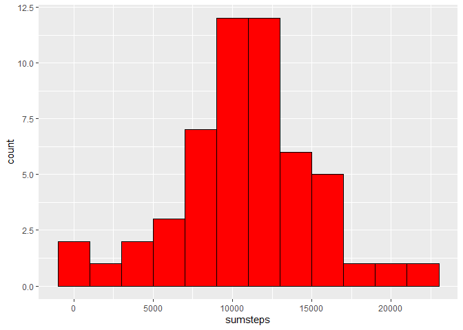
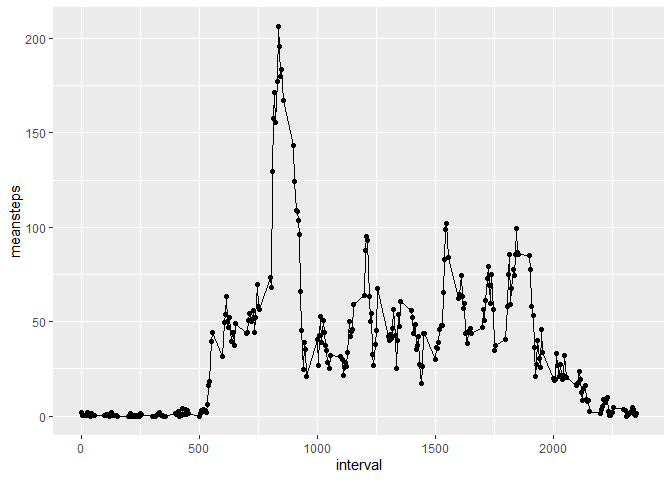
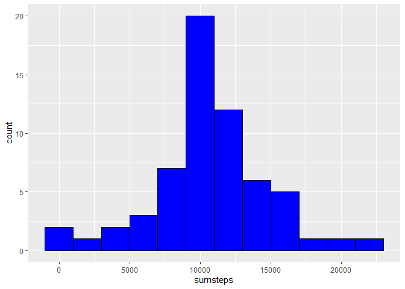
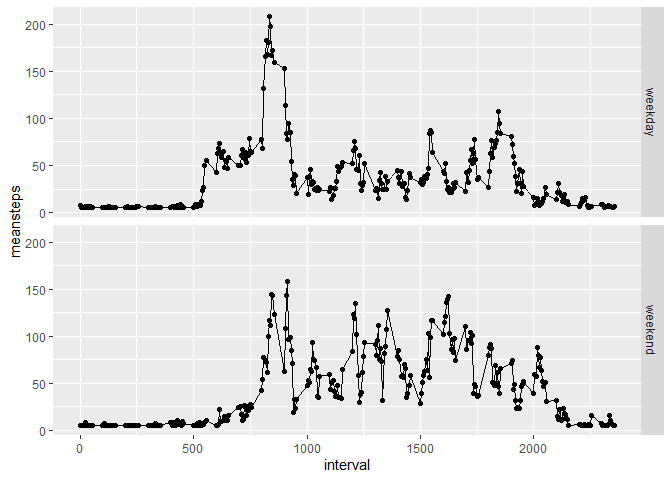

## Setting the environment

Load the needed packages.

```r
packages <- c("data.table","dplyr", "ggplot2", "knitr")
sapply(packages, require, character.only=TRUE, quietly=TRUE)
```

```
## 
## Attaching package: 'dplyr'
```

```
## The following objects are masked from 'package:data.table':
## 
##     between, first, last
```

```
## The following objects are masked from 'package:stats':
## 
##     filter, lag
```

```
## The following objects are masked from 'package:base':
## 
##     intersect, setdiff, setequal, union
```

```
## data.table      dplyr    ggplot2      knitr 
##       TRUE       TRUE       TRUE       TRUE
```

Set the environment

```r
opts_chunk$set(echo=TRUE)
```

## 1. Loading and preprocessing the data

For this assignement there is a dataset delivered in ZIP-format.
It will be unzipped and load as a dataframe.

```r
unzip(zipfile = "activity.zip")
activities <- read.csv("activity.csv")
```

For answering all the questions, the dataset has to be processed.
The variable date will be changed to date-type.

```r
activities$date<-as.Date(activities$date)
```

The following code is to display the results of processing the dataset.
Now we are ready to answer the questions.


```r
str(activities)
```

```
## 'data.frame':	17568 obs. of  3 variables:
##  $ steps   : int  NA NA NA NA NA NA NA NA NA NA ...
##  $ date    : Date, format: "2012-10-01" "2012-10-01" ...
##  $ interval: int  0 5 10 15 20 25 30 35 40 45 ...
```

```r
head(activities)
```

```
##   steps       date interval
## 1    NA 2012-10-01        0
## 2    NA 2012-10-01        5
## 3    NA 2012-10-01       10
## 4    NA 2012-10-01       15
## 5    NA 2012-10-01       20
## 6    NA 2012-10-01       25
```

```r
summary(activities)
```

```
##      steps             date               interval     
##  Min.   :  0.00   Min.   :2012-10-01   Min.   :   0.0  
##  1st Qu.:  0.00   1st Qu.:2012-10-16   1st Qu.: 588.8  
##  Median :  0.00   Median :2012-10-31   Median :1177.5  
##  Mean   : 37.38   Mean   :2012-10-31   Mean   :1177.5  
##  3rd Qu.: 12.00   3rd Qu.:2012-11-15   3rd Qu.:1766.2  
##  Max.   :806.00   Max.   :2012-11-30   Max.   :2355.0  
##  NA's   :2304
```

In this dataset we see a total of 2304 NA-values in the variable steps

## 2. What is mean total number of steps taken per day?
First we use dplyr-functions for compute the mean staps per day and then we use ggplot2-functions for making a histogram. For this question we create a new dataset and ignore the NA-values for the calculations and histogram to make.

### create a new dataset

```r
activities2<-activities %>%
              na.omit() %>%
              select(date,steps) %>%
              group_by(date) %>%
              summarize(sumsteps=sum(steps))
```

```
## `summarise()` ungrouping output (override with `.groups` argument)
```

### 2.1 Calculate the sum of the steps

```r
sum(activities2$sumsteps)
```

```
## [1] 570608
```

### 2.2 Plot a histogram of the sum of the steps per day

```r
ggplot( activities2 , aes(x=sumsteps) )+ 
  geom_histogram(binwidth = 2000,col="black",fill="red")
```

<!-- -->


### 2.3 Calculate mean and median of the steps

```r
mean(activities2$sumsteps)
```

```
## [1] 10766.19
```

```r
median(activities2$sumsteps)
```

```
## [1] 10765
```

## 3. What is the average daily activity pattern?

### Create a new dataset

```r
activities3<-activities %>%
              na.omit() %>%
              select(interval,steps) %>%
              group_by(interval) %>%
              summarize(meansteps=mean(steps))
```

```
## `summarise()` ungrouping output (override with `.groups` argument)
```

### 3.1 Plotting a timeseries-plot of the 5 min-interval of the mean of the steps per day

```r
ggplot( activities3 , aes(x=interval, y=meansteps)) + 
  geom_line() +
  geom_point()
```

<!-- -->


### 3.2 Calculate the 5 min-interval with the maximum mean of steps
With the folowing code we determine the maximum mean of steps in each interval. Then we filter the row with maximum mean.

```r
activities3 %>%
group_by(interval) %>%
summarize(max = max(meansteps)) %>%
filter(max == max(max))
```

```
## `summarise()` ungrouping output (override with `.groups` argument)
```

```
## # A tibble: 1 x 2
##   interval   max
##      <int> <dbl>
## 1      835  206.
```
As you can see, the maximum mean is 206 steps in interval 835.

## 4. Imputing missing values

### 4.1 Calculate the total of missing values
A summary of the dataset will display the count of missing values, mean, median etc.

```r
summary(activities)
```

```
##      steps             date               interval     
##  Min.   :  0.00   Min.   :2012-10-01   Min.   :   0.0  
##  1st Qu.:  0.00   1st Qu.:2012-10-16   1st Qu.: 588.8  
##  Median :  0.00   Median :2012-10-31   Median :1177.5  
##  Mean   : 37.38   Mean   :2012-10-31   Mean   :1177.5  
##  3rd Qu.: 12.00   3rd Qu.:2012-11-15   3rd Qu.:1766.2  
##  Max.   :806.00   Max.   :2012-11-30   Max.   :2355.0  
##  NA's   :2304
```
### 4.2 Strategy of replacing missing values
For imputing missing values in the dataset there are all kinds of strategies. For this assignment we keep it simple so we use the mean value of each interval for replacing the NA-values. This value is calculated in chapter 1 and is 37.38. See the code in 4.1.


### 4.3 Quick code to replace missing values with the mean

```r
activities$steps <- ifelse(is.na(activities$steps), mean(activities$steps, na.rm=TRUE), activities$steps)
```

### 4.4 Plot a histogram of the sum of the steps per day and calculate the sum, mean and median of the steps.


```r
#create a new dataset
activities4<-activities %>%
              select(date,steps) %>%
              group_by(date) %>%
              summarize(sumsteps=sum(steps))
```

```
## `summarise()` ungrouping output (override with `.groups` argument)
```

```r
# plot a histogram of the sum of the steps
ggplot( activities4 , aes(x=sumsteps)) + 
  geom_histogram(binwidth = 2000,col="black",fill="blue")
```

<!-- -->

```r
# display the sum, mean and median of the steps per day
sum(activities4$sumsteps)
```

```
## [1] 656737.5
```

```r
mean(activities4$sumsteps)
```

```
## [1] 10766.19
```

```r
median(activities4$sumsteps)
```

```
## [1] 10766.19
```

The total number of steps is increased and the impact on the median is just a litte.

## 5. Are there differences in activity patterns between weekdays and weekends?
By processing the data we added the variable daytype. So we can determine if the pattern of activity weekday vs. weekends.

### 5.1 Create a new factor variable in the dataset with two levels – “weekday” and “weekend”
The following code is adding a new variable daytype for categorize the rows in weekends and weekdays.

```r
activities$daytype<-as.factor(ifelse(weekdays(activities$date) %in% c("zaterdag","zondag"), "weekend","weekday"))
```

### 5.2 Make a panel plot containing a time series plot
We create a new dataset for calculating the mean per interval and daytype so we can make plots per daytype.

```r
#create the dataset
activities5<-activities %>%
              select(interval,daytype,steps) %>%
              group_by(interval,daytype) %>%
              summarize(meansteps=mean(steps))
```

```
## `summarise()` regrouping output by 'interval' (override with `.groups` argument)
```

```r
# make line-plots per daytype
ggplot( activities5, aes(x=interval,y=meansteps)) + 
  geom_point() + 
  geom_line() +
  facet_grid(daytype~.)
```

<!-- -->

The pattern for intervals of the weekdays and weekends are different. For the weekend in the lower intervals (left) the peaks are lower. In the higher intervals (right) the peaks are higher 
